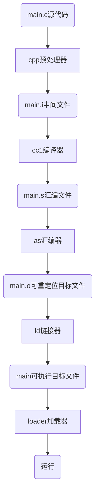
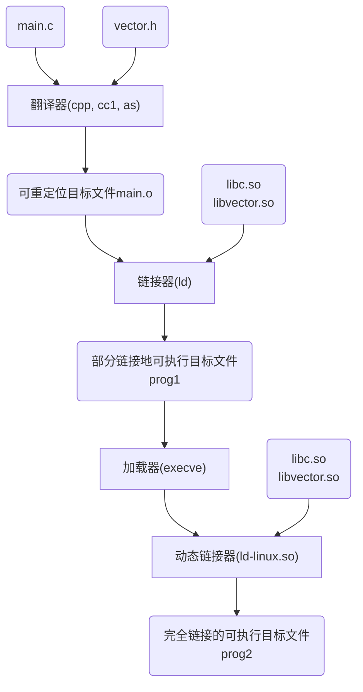
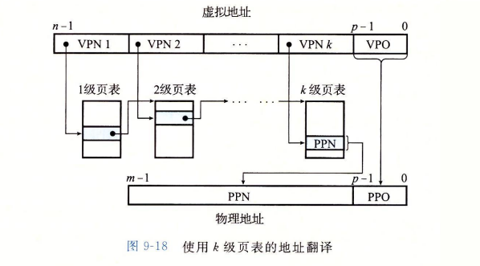
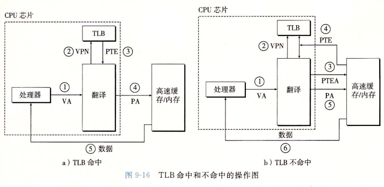
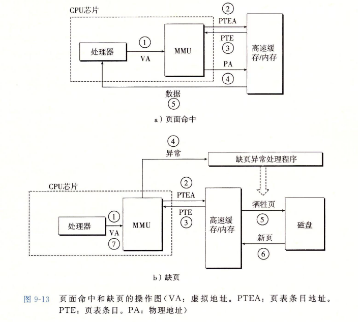
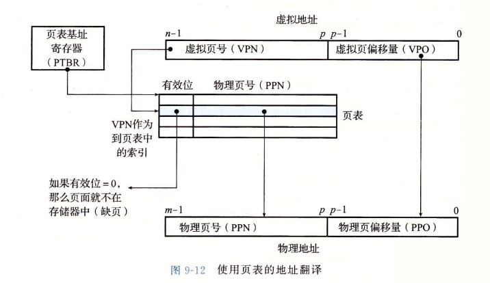
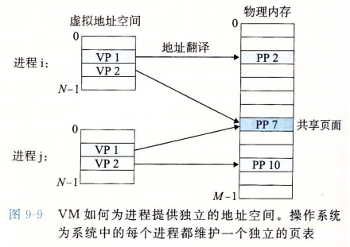
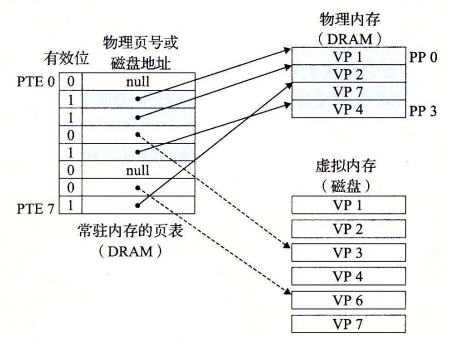
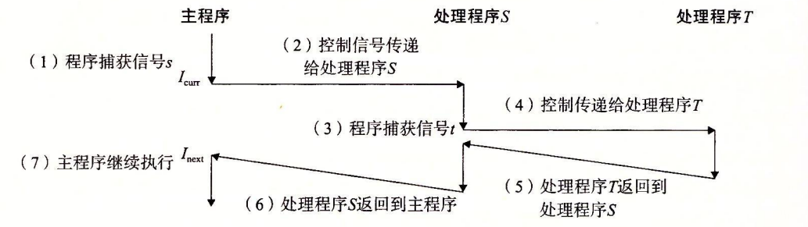
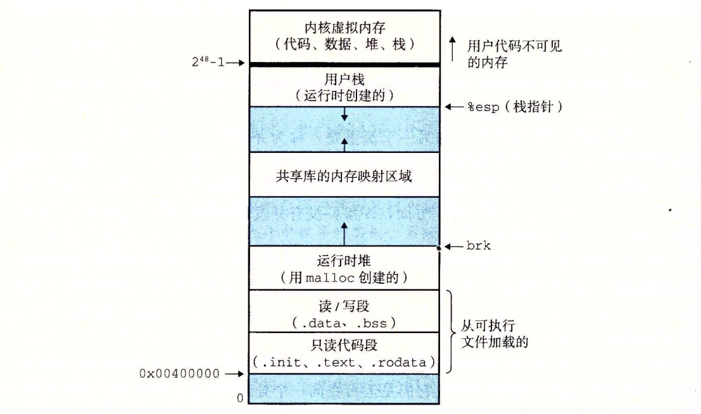

<div style="font-size: 50px; font-weight: bold; color: #777; margin: 22px 0; line-height: normal;">第一部分 程序结构和执行</div>

# 第一章 计算机系统漫游

# 第二章 信息的表示和处理

## 数据类型的转换

### 相同位数

以32位int和unsigned举例，基本原则是保持二进制表示不变，而将实际表示的数字调整。

```c
int a;
unsigned b;

a = 0xffffffff; // a = -1
b = (int)a;     // b = 0xffffffff
```

### 不同位数

如果两个类型的长度和符号都不相同，则遵循先扩展/收缩长度，再进行符号转换。

**扩展无符号**：补零

**扩展有符号**：补最高位

**截断无符号**：直接截断

**截断有符号**：直接截断

## IEEE浮点数表示

$V=(-1)^s\times M\times 2^E$

- $s$: 符号位；

- $M$: 尾数；

- $E$: 阶码。

在计算机中，我们也按照这三个部分来表示。

- 一个单独符号位$s$。
- $k$位阶码字段$e=e_{k-1}\cdots e_1e_0$编码阶码$E$。
- $n$位小数字段$f=f_{n-1}\cdots f_1f_0$编码尾数$M$，但是编码对应的值与$E$是否等于零有关（格式化与非格式化表示）。

共有三种情况

1. 格式化，$e$的各位不为全0页不为全1。$E=e-Bias$, $e$无符号数，Bias=$2^{k-1}-1$，$M=1+f$。
2. 非格式化，此时$e$各位全为0。$E=1-Bias$，$M=f$。
3. 特殊值，此时$e$各位全为1。如果$f$的各位全为0，则表示无穷大，否则表示NaN。

## 浮点之间，浮点与整形的转换

1. int->float，不会溢出，但是可能会损失精度；
2. int或float->double，不会溢出也不会损失精度；
3. double->float，有可能会溢出为$+\infty$或者$-\infty$，若不溢出，也可能损失精度；
4. float或double->int，向零取整，值可能会溢出，但是并未规定处理方式。

---

# 第三章 程序的机器级表示

# 第四章 处理器体系结构

# 第五章 优化程序性能

# 第六章 储存器层次结构

---

<div style="font-size: 50px; font-weight: bold; color: #777; margin: 22px 0; line-height: normal;">第二部分 在系统上运行程序</div>

# 第七章 链接

## 基本流程



## 静态链接

可重定向目标文件格式

| 部分      | 含义                                                                                                                                                     |
| --------- | -------------------------------------------------------------------------------------------------------------------------------------------------------- |
| ELF头     | 文件的元信息，包括ELF头本身大小，目标文件类型（可重定向，可执行，共享），机器类型，节头部表的偏移，节头部表中的条目大小和数量。                          |
| .text     | 以编译程序的机器代码。                                                                                                                                   |
| .rodata   | 只读数据，例如printf语句中的格式化字符串和switch语句的跳转表。                                                                                           |
| .data     | 已初始化的全局和静态C变量。局部C变量保存于栈中，既不存在于.data，也不存在于.bss。                                                                        |
| .bss      | 未初始化的静态C变量，以及所有被初始化为0的全局和静态C变量。区分是否初始化为0是为了节省空间。未初始化的全局变量将被放在COMMON伪节。                       |
| .symtab   | 符号表，存放程序中定义和引用的函数和全局变量的信息。和编译器的符号表不同，.symtab不包含局部变量。                                                        |
| .rel.text | .text节中位置的列表，当链接器将目标文件和其他文件组合时，需要修改这些位置。可执行目标文件不需要重定位信息，所以一般没有该条目。                          |
| .rel.data | 被模块引用或定义的所有全局变量的重定位信息。一般而言，任何已经初始化的全局变量，如果他的初始值是一个全局变量的地址或者外部定义函数的地址，都需要被修改。 |
| .debug    | 调试符号表，条目是程序中定义的局部变量和类型定义，程序中定义和引用的全局变量，以及C源文件。只有以-g选项调用编译器时，才会得到这张表。                    |
| .line     | C源程序中行号和.text节中机器指令之间的映射，只有以-g选项调用编译器时，才会得到这张表。                                                                   |
| .strtab   | 一个字符串表，内容包括.symtab和.debug中的符号表，以及节头部中的节名字。是以null结尾的字符串序列。                                                        |
| 节头部表  | 描述目标文件。                                                                                                                                           |

## 符号和符号表

可重定向目标文件m的.symtab中有三种不同的符号：

- 由模块m定义并能被其他模块访问的**全局符号**，全局链接器符号对应于**非静态C函数和全局变量**。
- 由其他模块定义并被m模块引用的的全局符号，称为**外部符号**，对应于在其他文件中定义的**非静态C函数和全局变量**。
- 只被模块m定义和引用的**局部符号**，对应于**静态C函数和静态全局变量**。

动态局部变量和全局静态变量有区别，前者由栈管理，链接器只考虑后者。

**但是**，局部变量也可以被声明为静态。此时它是不被栈管理的。相反，编译器会在.data或者.bss中为每个定义分配空间，并在符号表中创建有唯一名称的链接器符号。

符号表是由一种结构体构成的数组，结构体定义如下：

```c
typedef struct {
    int name;        // 在字符串表中的字节偏移，指向以null结尾的字符串名字。
    char type:4,     // 区分数据和函数。
    	 binding:4;  // 区分本地和全局。
    char reserved;
    short section;   // 符号所在节。
    long value;      // 符号的地址。在可重定向目标文件中，是距定义目标的节起始位置的偏移，而对于可执行目标文件来说，是一个绝对运行时地址。
    long size;       // 目标的大小，单位为字节。
} Elf64_Symbol;
```

符号表中的一个条目，还可以表示一个节，也可以用来表示原始文件路径名。

### 伪节

除了表中列出的节之外，还有三个伪节，在节头部表中没有条目。伪节仅存在于可重定向目标文件。

- **ABS**：表示不该被重定向的符号；
- **UNDEF**：表示未定义的符号，也就是在本目标模块中引用，但是在其他地方定义的符号；
- **COMMON**：表示还未被分配位置的未初始化的数据目标。此时，value字段给出对齐要求，size指的是最小的大小。

### COMMON和.bss的区别。

COMMON存放未初始化的全局变量（也就是弱符号）；

.bss存放未初始化的静态变量，以及初始化为0的全局和静态变量。

造成这一区分的主要原因是，编译器允许不同模块中有同名的符号。

## 符号解析

**强符号**：函数和已经初始化的全局变量；

**弱符号**：未初始化的全局变量。

三条规则

1. 不允许有同名的强符号；
2. 如果有强符号和弱符号同名，则选择强符号；
3. 如果若干弱符号同名，则随意选择一个。

## 静态库

多个标准可重定向目标文件，可以打包形成一个归档文件，以.a后缀名结尾，又称为**静态库**。

在使用gcc命令进行编译的时候，需要将用到的静态库显式地添加到命令行。

例如`gcc main.c /usr/lib/libm.a /usr/lib/libc.a `，而libc.a是被默认链接地，所以并不需要指出。

静态库的连接顺序是有所谓的。未定义的符号所在模块，必须出现在定义模块之前。

## 重定位

链接器知道了.text和.data的确切大小，可以进行地址的重定位。

1. 重定位节和符号定义。将所有模块的同种节合成一个，例如将所有模块的.data节合成一个大的.data节，输出到可执行目标文件的.data节。然后链接器为每个聚合节，聚合节中的每一个原始节，和节中出现的符号分配运行时内存地址。
2. 重定位节中的符号引用。修改代码和数据节中对每个符号的引用。这依赖于.rel.text和.rel.data两个重定位节。

代码的重定位条目放在.rel.text中，已初始化数据的重定位条目放在.rel.data中。

条目格式如下。

```c
typedef struct {
    long offset;    // 要被修改的引用相对于节的偏移。
    long type:32,   // 重定位类型，告诉链接器如何修改。
         symbol:32; // 该引用指向的符号。
    long addend;    // 一些类型的重定位需要使用该信息来修改偏移量。
} Elf64_Rela;
```

ELF定义了32种不同的重定位模式。

- **R_X86_64_PC32**：32位PC相对地址；
- **R_X86_64_32**：32位绝对地址。

这两种类型支持x86-64小型代码模型，即假设代码和数据总体大小小于2GB。

## 可执行目标文件

| 部分     | 段属性               | 内容                               |
| -------- | -------------------- | ---------------------------------- |
| ELF头    | 只读内存段（代码段） |                                    |
| 段头部表 | 只读内存段           | 将连续的文件节映射到运行时的内存段 |
| .init    | 只读内存段           |                                    |
| .text    | 只读内存段           |                                    |
| .rodata  | 只读内存段           |                                    |
| .data    | 读写内存段（数据段） |                                    |
| .bss     | 读写内存段           |                                    |
| .symtab  | 不加载到内存         |                                    |
| .debug   | 不加载到内存         |                                    |
| .line    | 不加载到内存         |                                    |
| .strtab  | 不加载到内存         |                                    |
| 节头部表 | 不加载到内存         | 描述目标文件的节                   |

### 程序头部表

描述了将代码段加载到内存的映射关系。

```
只读段
LOAD off    0x0000000000000000 vaddr 0x0000000000400000 paddr 0x0000000000400000 align 2**21
     filesz 0x000000000000069c memsz 0x000000000000069c flags r-x

读写段
LOAD off    0x0000000000000df8 vaddr 0x0000000000600df8 paddr 0x0000000000600df8 align 2**21
     filesz 0x0000000000000228 memsz 0x0000000000000230 flags rw-
```

filesz和memsz不一致的原因在于，.bss在目标文件中是不需要占用空间的，但是在内存中需要为其留出位置并初始化为0。

off和vaddr要求对齐，即$\text{vaddr}\pmod {\text{align}}=\text{off}\pmod {\text{align}}$。这种要求的原因，与虚拟内存的组织方式有关。

## 加载可执行目标文件

在命令行中执行内置命令或用`./prog`来执行一个可执行文件，或者调用``execve`函数，都可以调用加载器（loader）。

## 动态链接

静态库的一个问题是，所有进程都会加载相同的标准静态库函数，造成内存的极大浪费。

**共享库**在运行或加载时，加载到任意的内存位置，并和一个在内存中的程序链接起来。

共享库也叫共享目标，在Linux中以.so文件后缀结尾，在Windows中则是DLL（动态链接库）。

两种不同的共享方式：

1. 一个库只对应一个.so文件，所有引用该库的文件共享.text和.data中的数据，而不用嵌入到引用模块的可执行目标文件中；
2. 在内存中，共享库的.text节的一个副本可以被不同的正在运行的进程共享。



## 位置无关代码（PIC）

如何在多个进程中共享一个程序副本？

如果为每一个共享库都分配一个固定的地址空间，那么弊端很多，主要是难于管理，并且也有很大浪费。

可加载而无需重定向的代码称之为**位置无关代码（Position-Independent Code）**。

### 全局偏移量表（GOT）

首先，编译器在.data开始的地方创建一个**全局偏移量表（Global Offset Table）**。每个被该模块引用的全局数据目标（过程或者全局变量）都有一个8字节的条目。同时编译器还为GOT中的每一个条目生成一个重定向记录，由于代码段和数据段的间隔是不变的，编译器可以使用PC相对寻址来重定位。

### 过程链接表（PLT）

为了避免动态链接在加载时，对成百上千个不需要的符号进行重定位，GNU提出了**延迟绑定**。延迟绑定需要使用GOT和**过程连接表（Procedure Linkage Table）**两个数据结构。如果一个目标模块调用了共享库中定义的任何函数，那么他就有GOT和PLT。GOT是数据段的一部分，PLT是代码段的一部分。

## 库打桩机制

# 第八章 异常控制流

## 异常

异常的发生可能与当前执行的指令有关，例如当前指令发生了一些缺页错误，或者尝试除零；也可能与当前指令没有关系，例如定时器到时，或者IO操作完成。

当程序检测到有异常时，会通过**异常表**来进行间接的函数调用，到一个专门处理这些事件的操作系统子程序（异常处理程序）。处理完成后，根据异常事件的类型，会发生三种情况。

1. 将控制返回$I_{curr}$，重新执行；
2. 将控制返回$I_{next}$，跳过之前的指令；
3. 终止被中断的程序。

### 异常处理

系统为每种异常都分配了一个异常号码，有一些来自于处理器的设计者，有一些来自于操作系统内核。

系统在启动时，操作系统会分配并初始化一张异常表，每个条目都指向对应异常的处理函数的地址。

异常表的起始地址存放在名为**异常表基址寄存器**的特殊寄存器中。

异常处理函数的调用与普通函数调用有一些区别：

1. 将当前函数的返回地址压栈的时候，根据异常类型，要确定是压入当前指令地址，还是下一个指令的地址；
2. 处理函数会把一些额外的处理器状态压栈，但是栈有内核栈和用户栈的区别。处理函数由于处于内核态，则压入内核栈，同时它也对所有系统资源具有完全访问权限。

### 异常种类

- 中断（interrupt）
- 陷阱（trap）
- 故障（fault）
- 终止（abort）

| 类别 | 原因             | 异步/同步                    | 返回行为           |
| ---- | ---------------- | ---------------------------- | ------------------ |
| 中断 | 来自IO设备的信号 | 异步（与当前指令无关的异常） | 总是返回下一条指令 |
| 陷阱 | 有意的异常       | 同步（当前指令的直接产物）   | 总是返回下一条指令 |
| 故障 | 可能恢复的异常   | 同步（当前指令的直接产物）   | 可能返回当前地址   |
| 终止 | 不可恢复的异常   | 同步（当前指令的直接产物）   | 不会返回           |

**中断**

IO设备会异步地向CPU的一个引脚发送信号。

CPU会在**处理完当前指令之后**调用异常处理器，而不是直接打断执行到中间状态的当前指令，于是原来的进程就像没有受到中断一样，继续执行下一条指令。

**陷阱和系统调用**

是有意为之的异常，主要是用来进行系统调用，例如调用系统层的read，write，fork等等函数。

处理器提供了一个特殊的`syscall n`指令，n代表系统函数的编号。

**故障**

用户程序发生了一个错误情况，触发故障处理函数。如果处理函数能够修复故障，则会返回出现故障的用户指令重新执行，否则，处理函数将会直接在**内核态**发送一个新的终止异常，结束用户程序。

**终止**

终止是不可修复的致命错误，通常是一些硬件错误。

### Linux/x86-64系统异常

有256种异常，0-31号由Intel的设计师们定义，因此对于任何x86-64的机器，这些异常都是一样的，32-255号是由操作系统定义的中断和陷阱。

**Linux故障和终止举例**

_除法错误_：编号0，不会恢复，Linux shell通常会报“浮点异常（Floating exception）”的异常信息。

_一般保护故障_：编号13，有许多原因，但通常是由于程序引用了一个未定义的虚拟内存区域，例如访问空指针，或尝试修改一个只读片段。不会恢复，Linux shell通常报告为“段故障（Segmentation fault）”。

_缺页_：编号14，与虚拟内存的管理有关。

_机器检查_：编号18，硬件错误。

**Linux系统调用**

Linux提供了上百个系统调用，每个都对应于一个整数号，对应于内核中的一个跳转表（**注意该跳转表与异常表并不相同**）。

调用`syscall`指令即可进入内核态执行系统函数。在开始前，需要将编号存入%rax寄存器，并将可能用到的参数依次存入%rdi、%rsi、%rdx、%rcx、%r8、%r9这六个寄存器中。系统函数无法使用栈传递更多的参数，于是一个系统函数最多只有六个参数。

## 进程※

提供一种假象，让我们的程序独占所有计算机资源。

进程提供了两个关键抽象：

- 一个独立的逻辑控制流；
- 一个私有的地址空间。

### 私有地址空间

一般而言，一个进程所在的内存字节是不能被其他进程进行读写的，也就是所谓私有。

每个进程的地址空间都有相同的结构。



### 用户态和内核态

处理器必须限制一个应用可以执行的指令和可以访问的地址空间范围。通常用一个模式位来提供这种功能。当设置了该模式位时，系统处于内核态，可以访问内存中的任何位置。

在用户态中，如果直接执行特权指令，例如停止处理器，改变模式位，发起IO操作，或者访问内核态的代码和数据，都会直接导致保护故障。用户必须通过系统调用接口来间接的调用内核数据和代码。

用户态进入内核态的**唯一方法**是触发异常。

Linux提供了一种/proc文件系统，他允许用户访问内核数据结构的内容，例如CPU类型，某个进程所使用的内存段。

### 上下文切换

以进程A进行read系统调用为例。

1. 进程A通过系统调用触发陷阱异常，进入内核态；
2. 内核在执行了一部分陷阱处理逻辑之后，将需要等待磁盘的返回，此时它将进行上下文切换，切换到进程B的内核态；
3. 系统进入进程B的用户态并执行代码；
4. 进程B在执行过程中，受到了来自磁盘的中断，表示数据已经读取成功；
5. 进程B进入内核态，随后内核将上下文切换回A进程；
6. 系统进入进程A的用户态，继续执行剩余的用户代码。

### 系统调用的错误

和用户函数一样，系统调用也可能出现错误。此时通常会返回-1，并设置全局整数变量`errno`来表示出了什么问题。

通过`strerror(errno)`函数，我们可以将errno对应的错误信息打印出来。

## 进程控制※

接下来将复习Unix的进程控制函数，数量较多。

### 进程ID

每个进程都有一个正数进程ID。可以通过getpid获取，getppid则返回父进程的pid。

```c
pid_t getpid(void);
pid_t getppid(void);
```

### 创建和终止进程

进程的状态有三种：

- **运行**：或者正在执行，或者在等待内核再一次切换上下文回来继续执行；
- **停止**：被挂起，且不会被调度。当收到SIGSTOP，SIGTSTP，SIGTTIN或者SIGTTOU等信号时，进程就会停止。当他收到SIGCONT信号时，程序再次回到运行状态；
- **终止**：程序永远的停止了，原因可能有三个：
  1. 收到默认行为为终止进程的信号；
  2. 从主程序返回；
  3. 调用了`exit`函数。

```c
void exit(int status);
// 不返回。
```

父进程可通过`fork`函数创建一个新的进程。

```c
pid_t fork(void);
// 返回：子进程为0，父进程为子进程PID；出错则返回-1。
```

- 调用一次，返回两次，分别在父进程和子进程中。在父进程中，返回的是子进程的PID，在子进程中，返回0。通过这一特性，我们就可以区分当前进程是父进程还是子进程。
- 并发执行。进程一旦创建完毕，父子进程的执行是并发的，他们可能以任何可能的顺序交替执行。
- 相同但是独立的地址空间。`fork`函数执行完之后，两进程的地址空间及其内容是一样的，但是针对其进行的修改是完全独立的。
- 共享文件。子进程会继承父进程打开的所有文件。

### 进程回收

进程的三种状态之一是终止。但是终止并不意味着系统会将该进程所占用的资源立刻回收，清空，并释放。父进程需要主动地去回收它。一个终止但并未被回收的进程称之为僵尸进程。当父进程回收子进程时，内核可以将子进程的退出状态传递给父进程。

系统中的所有进程，都是init进程的子进程。init的PID是1，是所有进程的祖先，在系统启动时被内核创建，永远不会退出。

在一个进程退出时，如果他存在孤儿进程，则init会主动去收养该进程作为自己的子进程。如果一个父进程在退出时并未回收其僵尸子进程，则init会自动回收他们。但是，对于长时间不退出的进程，例如shell或者服务器，我们需要手动去回收其子进程。

```c
pid_t waitpid(pid_t pid, int *statusp, int options);
// 返回：如果成功，则为子进程PID；如果options设置了WNOHANG则为0；其他为-1。
```

该函数的行为**比较复杂**。

**默认情况下（options=0）**，进程被挂起，直到其*等待集合*中的某一个子进程终止。

**修改等待集合**，通过指定pid参数来控制。

- **pid>0**：等待PID=pid的进程返回。
- **pid=-1**：等待集合为父进程的所有子进程。

**修改默认行为**，通过修改options来控制。

- **WNOHANG**：如果调用的时候，等待集合里面没有已经终止的子进程，则立即返回。
- **WUNTRACED**：除了等待终止，也等待停止。
- **WCONTINUED**：除了等待终止，也等待一个等待集合中被停止的进程被SIGCONT重新激活。

可以将他们用或运算组合起来。

**检查已回收子进程的退出状态**

设`int status = *statusp;`（如果statusp非空）。

`waitpid`会修改改指针指向的值，然后父进程可以用一些预定义的宏来获取信息。

- **WIFEXITED**：如果子进程正常终止，则返回真。
- **WEXITSTATUS**：返回退出状态。
- **WIFSIGNALED**：如果子进程是因为一个未被捕获的信号终止的，则返回真。
- **WTERMSIG**：返回引起终止的信号编号。
- **WIFSTOPPED**：如果因为子进程停止而返回，则返回真。
- **WSTOPSIG**：返回引起子进程停止的信号编号。
- **WIFCONTINUED**：如果因为子进程重新运行而返回，则返回真。

**错误返回**

如果没有子进程，则返回-1，并设置`errno`为`ECHILD`；如果`waitpid`被一个信号中断，则返回-1，并设置`error`为`EINTR`。

### 进程休眠

可以用`sleep`来让进程休眠指定时间。

```c
unsigned int sleep(unsigned int secs);
// 返回：还要休眠的秒数。
```

`sleep`如果达成了设置的休眠时间，则返回0。但是他有可能被一个信号提前中断，此时返回剩余秒数。

如果想让程序休眠，直到收到一个信号，则应使用`pause`。

```c
int pause(void);
// 返回：总是-1。
```

### 加载并运行程序

`execve`可以在当前进程的上下文中，加载并运行一个程序。

```c
int execve(const char *filename, const char *argv[], const char *envp[]);
// 返回：如果成功则不返回，否则返回-1。
```

filename表示可执行文件的文件名，argv提供程序运行的字符串参数数组，而envp提供环境键值对。

以下函数可以操作环境数组。

```c
char *getenv(const char *name);
// 返回：若存在则返回指向name的指针，否则返回NULL。
int setenv(const char *name, const char *newvalue, int overwrite);
// 返回：成功为0，失败为-1。
void unsetenv(const char *name);
```

## 信号※

一个信号就是一条消息，用来通知进程系统中发生了某些事件。

- 进程尝试除零，则内核会给该进程发一个**SIGFPE**信号。
- 进程执行一条非法指令，则内核会给进程发一个**SIGILL**信号。
- 进程进行非法内存引用，则内核会给进程发一个**SIGSEGV**信号。

### 信号术语

传送一个信号到目标进程需要两步。

- _发送信号_：内核通过更新目的进程上下文中的某个状态，发送一个信号给目的进程。发送原因可能有：
  - 内核检测到一个系统事件，比如除零错或者子进程终止。
  - 一个进程调用了kill函数，将信号发给自身进程或其他进程。
- _接收信号_：目的进程被内核强迫对发来的信号进行反应。进程可以忽略这个信号，终止或者通过用`signal`函数捕获这个信号，并自定义针对该信号的处理逻辑。目标进程在执行到$I_{curr}$被打断之后，内核将控制流交给信号处理函数，可能是系统内置，也可能是用户自定义的函数。执行完成之后，内核将控制流返回目标进程，继续执行$I_{next}$。

_待处理信号_：一个已发出但未被接收的信号。一个类型的信号至多有一个待处理信号。一个进程可以阻塞某些信号，阻塞后，该种信号仍可以被发送给目标进程，但是不会被接受，直到目标进程取消对该信号的阻塞。

如果进程阻塞了k号信号之后，k号信号被发送给该进程，则内核会设置pending位向量的第k位。

### 发送信号

#### 进程组

```c
pid_t getpgrp(void);
// 返回：调用进程的进程组ID。
int setpgid(pid_t pid, pid_t pgid);
// 返回：成功为0，失败为-1。
```

子进程默认与父进程处于相同PGID。调用`setpgid`可以改变自己或者其他进程的PGID。

pid为0时，使用当前进程的PID；pgid为0时，使用pid指定的PID作为PGID的数字。

#### /bin/kill命令

```shell
$ /bin/kill -9 15213  // 发送9号信号给15213进程。
$ /bin/kill -9 -15213 // 发送9好信号给15213进程组中的所有进程。
```

#### 从键盘发送信号

按下Ctrl+C，可以向shell的前台进程组中的每个进程发送一个SIGINT信号。

类似地，按下Ctrl+Z则发送SIGTSTP信号到前台进程组中的每个进程。

#### kill函数

```c
int kill(pid_t pid, int sig);
```

- `pid`>0：发送`sig`号信号给`pid`进程。
- `pid`=0：发送给调用进程所在进程组的每一个进程，包括自己。
- `pid`<0：发送给进程组`|pid|`中的每一个进程。

#### alarm函数

```c
unsigned int alarm(unsigned int secs);
// 返回：前一次设置闹钟的剩余秒数，若以前没有设置过，则返回0。
```

在`secs`秒后，向自己发送一个SIGALRM信号。

如果在上一个闹钟尚未触发的时候就又调用了`alarm`函数，则之前的闹钟被取消，只保留新闹钟，并返回上次闹钟所剩秒数。

### 接收信号

信号处理的时机：进程从内核态转变为用户态时（系统调用结束或者上下文切换）。

会检查未被阻塞的待处理信号集合。如果有，则选择某一个进行处理。

每个信号都有默认处理行为：

- 进程终止。
- 进程终止并转储内存。
- 进程停止知道被SIGCONT重启。
- 进程忽略改信号。

可以通过`signal`函数修改该进程对某一信号的默认处理行为。（**注意：SIGSTOP和SIGKILL两信号是唯二默认行为不能被修改的信号**）

```c
sighandler_t signal(int signum, sighandler_t handler);
// 返回：若成功则返回前次处理函数的指针，若失败则返回SIG_ERR（并不设置errno）。
```

`handler`可以传入三种值：

- **SIG_IGN**：忽略。
- **SIG_DFL**：恢复默认。
- **函数指针**：执行改函数流程。

**注意，信号的处理函数也可以被其他信号打断。**



### 阻塞与解阻

分为两种：

- _隐式阻塞_：若内核正在执行信号s的处理程序，此时进程又收到了一个信号s，则该信号不会被立即接收，也不会被取消，而是称为待处理信号。
- _显式阻塞_：程序调用`sigpromask`及相关辅助函数。

```c
int sigpromask(int how, const sigset_t *set, sigset_t *oldset);
int sigemptyset(sigset_t *set);
int sigfillset(sigset_t *set);
int sigaddset(sigset_t *set, int signum);
int sigdelset(sigset_t *set, int signum);
// 返回：均为成功0，失败-1。
int sigismember(const sigset_t *set, int signum);
// 返回：如果signum是set的成员则返回1，不是则返回0，出错返回-1。
```

其中，`how`的语义为如何改变当前信号集。有如下三种方式：

- **SIG_BLOCK**：将set中的信号添加到blocked中。
- **SIG_UNBLOCK**：删除set中的信号。
- **SIG_SETMASK**：block=set。

### 编写singal handler信号处理程序

安全信号处理的一些原则。

1. **处理函数要尽可能简单**。
2. **调用异步信号安全的函数**。在处理函数中调用其他外部函数时，该外部函数可能会被其他信号中断，导致处理函数被间接中断。应该使用一些保证异步信号安全的函数。他们要么是*可重入的*，要么不会被其他信号中断。
3. **保存和回复errno**。主程序中可能会用到errno。如果在处理函数中也调用了一些内核函数，则会干扰主程序的判断。应该保证在执行处理函数前后，errno不变。
4. **阻塞所有信号，保护全局数据访问**。
5. **用volatile声明全局变量**。volatile告诉编译器，不要缓存该变量。由于信号处理函数处于内核态，不经过主函数的缓存路线，而直接将变量在内存中修改，用户态函数无法穿透缓存而读取到内存中的最新值。
6. **用sig_atom_t声明标志**。保证读写的原子性。

**竞争问题（race）**

子进程结束会给父进程发送**SIGCHLD**信号，父进程自定义处理函数，捕获之后进行一些处理。但是处理函数和父进程程序中的一些操作可能存在顺序冲突。

```c
int sigsuspend(const sigset_t *mask);
// 返回：-1。
```

该函数等价于如下流程的原子版本：

```c
sigpromask(SIG_SETMASK, &mask, &prev);
pause();
sigpromask(SIG_SETMASK, &prev, NULL);
```

可以使用该函数暂时取消某一信号的阻塞，然后不可中断地进入pause。此时，如果已经有了待处理信号，则pause会被信号唤醒。

## 非本地跳转（未完）

将控制直接从一个函数转移至另一个当前正在执行的函数，而不需要通过正常的调用返回。非本地跳转通过`setjmp`和`longjmp`函数实现。

```c
int setjmp(jmp_buf env);
int sigsetjmp(sigjmp_buf env, int savesigs);
// 返回：setjmp返回0，sigsetjmp返回非0。
```

# 第九章 虚拟内存※

## 物理和虚拟地址

主存是一个由M个连续的字节大小的单元组成的数组，每个单元对应了一个地址。

如果我们拿到一个地址值并且直接用该地址取出内存中的值，则称为**物理寻址**。

然而，我们可以**虚拟寻址**。

CPU首先生成一个虚拟地址，但是这个地址并不能直接被用于寻找内存中的数据，需要经过一个 **内存管理单元（MMU）**的翻译，转化为物理地址后，才能取出数据。MMU利用存放在主存中的查询表来进行动态翻译，该表内容由操作系统管理。

## 地址空间

一个非负整数组成的有序集合$\{0,1,2,3,\cdots\}$可以称之为一个地址空间。我们总是假设他是连续的。

CPU从一个有$N=2^n$的地址空间中生成虚拟地址。

一个包含$N=2^n$的地址空间称为$n$位地址空间。现代操作系统通常支持32位或者64位虚拟地址空间。

物理地址空间字节数$M$不要求一定是2的幂次，但为了方便讨论，假设$M=2^m$。

## 虚拟内存作为缓存的工具

虚拟内存存储于磁盘上。

主存可以看成是磁盘的缓存，于是二者之间的信息交流有一个固定大小的单位长度。系统将虚拟内存分割为**虚拟页**，每一页的大小是固定的，一般是2的幂次$P=2^p$。类似地，物理内存被分割为**物理页**，大小也为$P$字节，物理页也被称为页帧。

任何时刻，虚拟页的集合都分为三个不相交的子集：

- **未被分配的**：VM系统尚未分配或创建的页。不占用磁盘空间。
- **缓存的**：已缓存在物理内存中的已分配页。
- **未缓存的**：未缓存在物理内存中的已分配页。

### DRAM组织结构

DRAM如果miss了，那么到磁盘中去读取数据的延迟是巨大的。

所以为了尽量避免cache miss，虚拟页往往都很大，通常是4KB~2MB。

虚拟页是fully-associative的，也就是只有一个set，任何虚拟页可以放到任何物理页中。替换算法要比SRAM缓存更复杂精密。

### 页表

既然虚拟内存是物理内存的缓存，则需要一个表来记录信息。

页表是存放在物理内存中的数据结构，将虚拟页映射到物理页。



在如图所示的例子中，第0，5号虚拟页尚未被分配所以是null；第1，2，4，7号虚拟页已经被缓存到物理内存中，剩下的第3，6号尚未被缓存。

### 命中

此时，如果CPU想要访问第2号虚拟地址，那么他就会被翻译成物理内存中的PP1。此时称为页命中。

### 缺页

如果页表没有查询到对应的记录，则出现了一次miss，称为**缺页**。

如果CPU想要访问VP3，则系统触发缺页异常，并调用缺页异常处理程序，它会选择一个物理内存中的牺牲页（PP3对应的VP4）。如果VP4已经被修改，则内核会将他复制回磁盘。然后无论是否修改，都会将页表中关于VP4的信息抹除。然后内核从磁盘复制VP3中的内容到PP3，同时更新页表。然后处理程序返回，重启触发缺页异常的指令，此时他就可以正常访问VP3。

一般情况下，页的写入和擦除都是在发生miss的情况下才进行，这称之为**demand paging**。也可以按照某种方式，预测可能的miss，在页实际被饮用之前就提前准备好。不过，所有现代机器都不会做这种预测。

### 分配（malloc）

将页表中一些尚未分配的条目，在磁盘上分配新的空间。

## 虚拟内存作为内存管理的工具

一些早期系统中，虚拟内存小于物理内存。即便如此，它也可以作为管理内存一个有用的工具。

系统为每个进程提供了独立的页表。



在此示例中，两进程的共享了一个物理内存页PP7。在两个进程中访问同一个VP1地址，最终指向的物理地址是不同的。它的作用体现在：

1. **简化链接**。允许了每个进程使用完全相同的内存结构。
2. **简化加载**。分配新的虚拟页，用于加载可执行目标文件的各个段，而不需要实际去磁盘中读写物理页。
3. **简化共享**。一般而言，不同进程的虚拟地址空间是私有的，在物理内存中不会被映射到相同的地址。但是，想printf这种大家都会用到的程序，操作系统会将其映射到相同的物理页面。
4. **简化内存分配**。直接在虚拟内存中分配连续的k个页，而不需要在物理内存中寻找。

## 虚拟内存作为内存保护的工具

我们需要限制用户态函数对只读代码段的修改，不能允许他访问内核态的代码和数据，也不能让其读写其他进程的私有内存，除非是共享的。

在内核分配一个虚拟页时，可以在页表中的条目里面添加一些控制位，来区分权限。

例如，PTE中有三个许可位：

- **SUP**：表示进程是否必须为内核态。
- **READ**：读权限。
- **WRITE**：写权限。

## 地址翻译※

基本参数和术语。

| 符号    | 描述               |
| ------- | ------------------ |
| $N=2^n$ | 虚拟地址的地址数量 |
| $M=2^m$ | 物理地址的地址数量 |
| $P=2^p$ | 页大小             |
| VPO     | 虚拟页偏移量       |
| VPN     | 虚拟页号           |
| TLBI    | TLB index          |
| TLBT    | TLB tag            |
| PPO     | 物理页偏移量       |
| PPN     | 物理页号           |
| CO      | cache offset       |
| CI      | cache index        |
| CT      | cache tag          |

### 基本流程



上图展示了MMU使用页表来进行翻译的基本流程。

CPU中有一个特殊寄存器称为**页表基址寄存器（PTBR）**，指向当前进程的页表。

n位虚拟地址包含两部分：

- **VPO**：$p$位，代表着在一个页中，想要读取的字节的起始位置。
- **VPN**：$(n-p)$位，代表虚拟页号。

MMU利用VPN来选去适当的PTE。由于虚拟和物理内存的页大小都是$P$字节，所以PPO和VPO是相等的。

### 具体流程



#### hit

1. CPU生成一个虚拟地址，传给MMU。
2. MMU生成PTE的地址，并利用各级缓存或主存找到它。
3. 各级缓存或主存返回给MMU一个PTE。
4. MMU组装物理地址，并传给各级缓存或主存。
5. 各级缓存或主存将数据返回CPU。

**注意**，PTE的地址（PTEA）和要找的地址是不一样的。页表是常驻于内存的，并通过PTBR寄存器加上条目编号的方式定位。

#### miss

1. 同上。
2. 同上。
3. 同上。
4. PTE中的有效位为0，意味着缺页。MMU触发一次异常，将控制传递给缺页异常处理程序。
5. 处理程序确定物理内存中的牺牲页，若该页被修改，则写回磁盘，否则则不需要。
6. 缺页异常换入新页面，并更新PTE。
7. 处理函数将控制交回给原进程，再次执行触发缺页的指令，从头执行，本次执行会hit。

### 高速缓存中的地址

大多数系统选择物理地址。PTEA也可以参与缓存。

### TLB

除了查询目标物理地址，每次翻译的时候，都必须要在各级缓存或者主存中查找PTE的地址，针对PTEA，我们也可以有一个小缓存器，名为**翻译后备缓冲器（TLB）**

TLB中存储虚拟地址，每一行都是有一个PTE组成的块。

假设TLB有$T=2^t$个set，那么TLBI是由VPN地最低$t$位组成的，剩余位组成TLBT。



**注意**，此处可以使用虚拟地址而不担心不同进程之间混乱的原因是，各个进程的页表物理地址是存在PTBR中的，是不同的。

### 多级页表

问题：需要的页表条目太多，占用空间太大。由此引出了多级页表的概念。

举例说明，假设虚拟地址为32位，页大小为4KB，一个PTE是4字节。

一级页表映射的是很多连续页表组成的一个大块，或成为**片（chunk）**。此时，一个32位系统只需要1024个一级页表项就够了。

但是只有一级页表，是无法查到某一准确的PTE的。假设一级页表的一个条目已经被分配，则它指向的二级页表是存在的，是连续的1024个PTE。

我们很精确的构造，使得一二级页表都是正好一个页的大小。



如图所示，我们对一个虚拟地址进行切分，使用不同的位来到每级页表中去查询，最终得到PPN。然后与VPO组装，形成一个物理地址。

## 案例

## 内存映射

## 动态内存分配

---

<div style="font-size: 50px; font-weight: bold; color: #777; margin: 22px 0; line-height: normal;">第三部分 程序间的交互和通信</div>

# 第十章 系统级I/O

# 第十一章 网络编程

# 第十二章 并发编程
