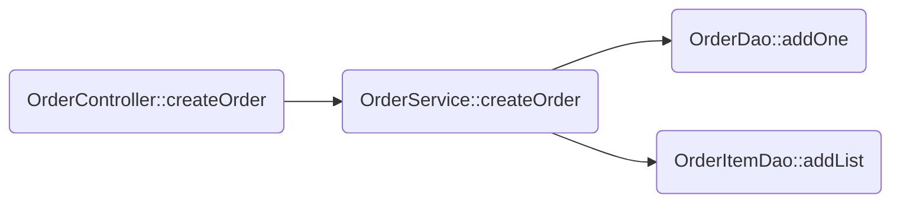

# 问题背景

在做app作业一的第二部分时，遇到了问题（自以为是问题，没想到老师是故意让我们发现这是个bug）。



如图，在电子书服务系统`E-Book`中，我们进行订单创建，一个订单`order`中包含多个订单项`orderItem`。

现在我们要对`OrderService::createOrder`，`OrderDao::saveOne`和`OrderItemDao::saveList`进行事务传播控制，分别简称三部分为A，B，C。

若A和B设置为`REQUIRED`，而C设置为`REQUIRES_NEW`，则会出现死锁问题。

源代码大致如下。

```java
// OrderServiceImpl.java
@Transactional
public void createOrder(List<Integer> bookIds, Long userId) {
    Order order = new Order();
    order.setUser(userDao.findOne(userId));
    orderDao.addOne(order);

    // 准备orderItems的List
    List<OrderItem> orderItems = new ArrayList<>();
    ...;

    orderItemDao.addList(orderItems);
}

// OrderDaoImpl.java
@Transactional
public void addOne(Order order) {
    orderRepository.save(order);
}


// OrderItemDaoImpl.java
@Transactional(propagation = Propagation.REQUIRES_NEW)
public void addList(List<OrderItem> orderItems) {
    orderItemRepository.saveList(orderItems);
}
```

执行结果为死锁。

<br>

# 原因分析

在B执行后，由于与A处在同一事务一里，则事务一拿到了`order`表中新插入行的锁，不管事务隔离属性如何设置，其他事务均不可进行写操作。而在随后的C流程中，写入`orderItems`的时候，`order_item`表中有`order`的外键，于是他在给`order_item`新插入的数据上锁之外，也要在`order`表中对外键所指向的数据加锁。

然而C是拿不到的，因为B已经拿到了。

于是此时，C等待B放锁，但是同时，B又等待C结束返回，从而形成了死锁。

<br>

# 解决方法

该问题说明，并不是所有业务使用`REQUIRES_NEW`传播都可以，在此场景下，都使用默认的`REQUIRED`传播属性即可。
