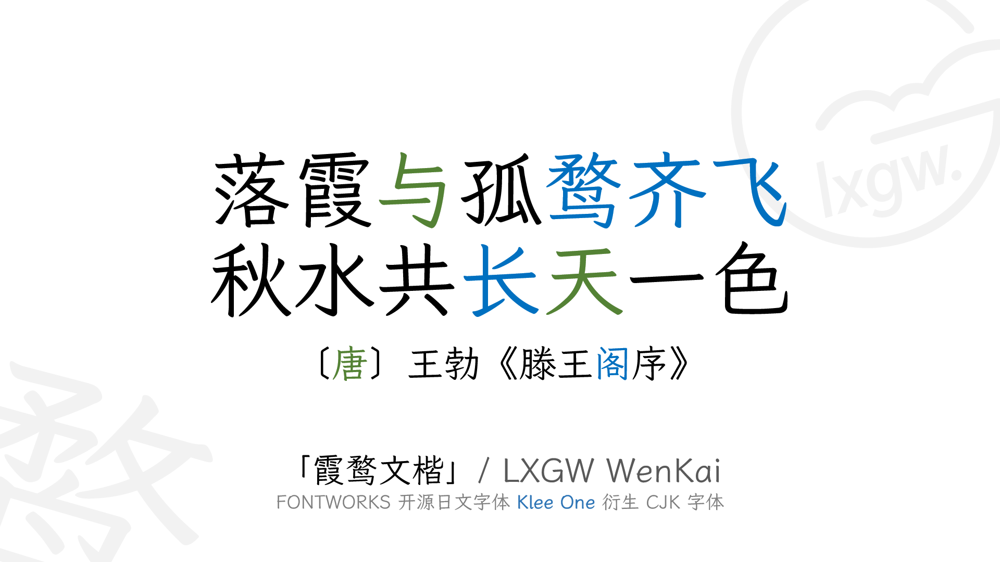
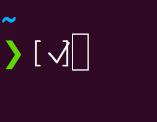
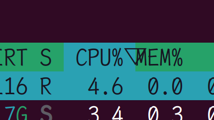
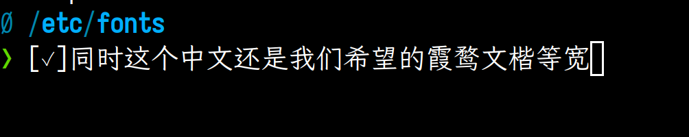
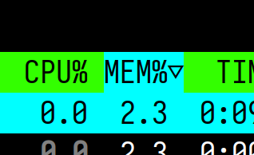

# 痛点

最近使用coding agent，比如opencode，大多数都可以直接在Terminal User Interface(TUI)中进行对话。

这就给中文程序员带来了不便。

因为默认的终端字体对中文的支持比较一般，到不是说显示不出来字体，而是感觉那种方方正正的黑体比较难看。

之前我在ubuntu的系统中下载过一个[霞鹜文楷等宽](https://github.com/lxgw/LxgwWenKai)，LXGW WenKai Mono，效果还是很好看滴～



# 但是

这个字体倾向于把很多西文符号设置为ambiguious宽度，比如opencode在TUI中展示todo列表完成情况时，就会用一个对勾[✓]，终端认为他是半角宽度，但是实际上他的设计宽度是全角，就会出现一个字符重叠的问题。还有htop在某些比较新的版本上，他在排序进程时，会在目录栏加一个三角符号，表示是正序还是倒序。




# 解决方案

linux很多发行版中，字体管理都是通过fontconfig来配置的，在终端看看有没有fc-macth, fc-cache, fc-list等命令，如果有的话，那就是已经安装了fontconfig。

以我的ubuntu为例，系统默认的fontconfig配置文件在`/etc/fonts`下的fonts.conf，这个是使用fc-cache更新字体缓存时自动生成的一个文件，修改他是没有用的。应该在这里新建一个local.conf文件，并输入如下配置：

```
<match target="pattern">
  <test name="family">
    <string>monospace</string>
  </test>
  <edit name="family" mode="prepend" binding="strong">
    <string>Iosevka Term</string>
    <string>LXGW WenKai Mono</string>
  </edit>
</match>
```

保存之后最好再运行一下`fc-cache -fv`来更新字体文件和配置的缓存。

可以通过`fc-match "monospace"`来检查，如果输出的是`SGr-IosevkaTerm-Regular.ttc: "Iosevka Term" "Regular"`的话，那就是配置成功了，因为系统对monospace这个字体的默认回退显然不是Iosevka。

这个[Iosevka Term](https://github.com/be5invis/iosevka)是一个我自己安装的别的字体。

这个配置项的意思是，在任何gnome应用寻找monospace这个字体时，从使用原来系统默认的monospace这个字体的回退方案，改成我们自己配置的这两个字体，并且先在Iosevka Term中找，找不到，再回退到LXGW WenKai Mono。因为Iosevka Term能确保西文字体和符号的宽度准确性，同时这个字体又肯定没有中文的支持，所以遇到中文会自动回退到第二个选择，也就是我们想要的LXGW WenKai Mono。




# More

可以再探索一下fontforge，对单个字体文件的某个码点进行自定义修改，不过这个比较麻烦
