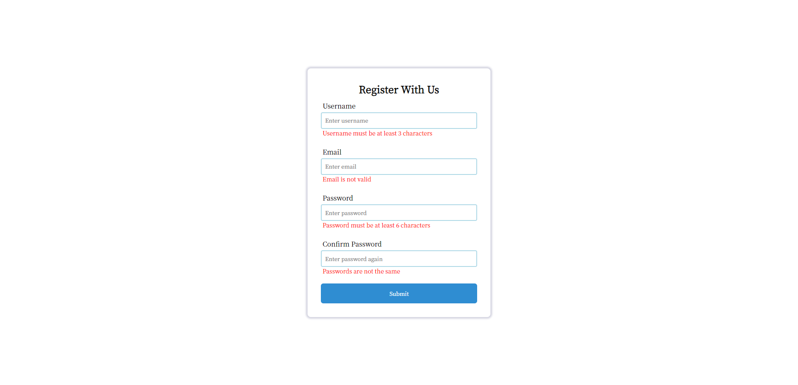
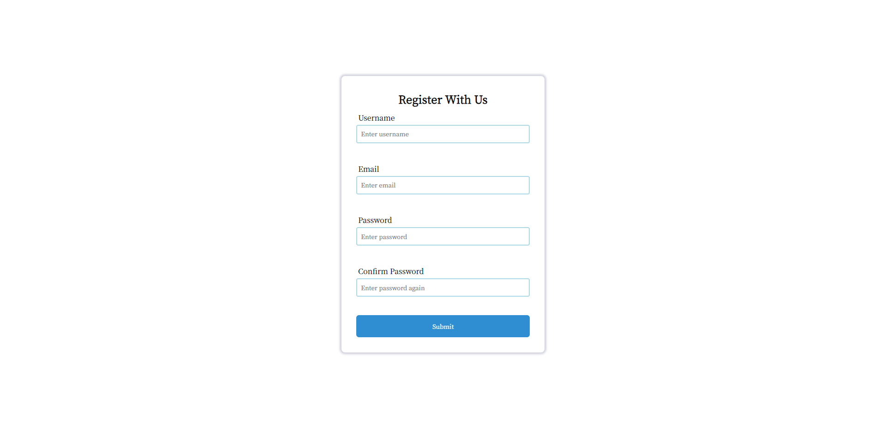

用了react的useState钩子，不过总感觉有很多赘余的部分，比如四个输入框的信息分别维护，而不是统一由一个四个元素组成的变量控制。

接下来可以尝试做一个贪吃蛇。

~~（已经失败了。。）~~

主要代码如下：

```js react
import { useState } from "react";
import "./App.css";

const InputItem = ({ handleInput, title, placeholder, error, isError }) => {
  return (
    <>
      <p className="entry-name">{title}</p>
      <input
        className="input"
        type="text"
        placeholder={placeholder}
        onBlur={(e) => {
          handleInput(e.target.value, title);
        }}
      />
      <p className="error">{isError && error}</p>
    </>
  );
};

export default function App() {
  const [username, setUsername] = useState("");
  const [email, setEmail] = useState("");
  const [password, setPassword] = useState("");
  const [confirm, setConfirm] = useState("");

  const [usernameError, setUsernameError] = useState(false);
  const [emailError, setEmailError] = useState(false);
  const [passwordError, setPasswordError] = useState(false);
  const [confirmError, setConfirmError] = useState(false);

  const handleInput = (value, title) => {
    if (title === "Username") {
      if (value && value.length >= 3) {
        setUsernameError(false);
        setUsername(value);
      } else setUsernameError(true);
    } else if (title === "Email") {
      const emailReg = /^([a-zA-Z0-9_-])+@([a-zA-Z0-9_-])+(\.[a-zA-Z0-9_-])+/;
      if (value && emailReg.test(value)) {
        setEmailError(false);
        setEmail(value);
      } else setEmailError(true);
    } else if (title === "Password") {
      if (value && value.length >= 6) {
        setPasswordError(false);
        setPassword(value);
      } else setPasswordError(true);
    } else {
      if (value && value === password) setConfirmError(false);
      else {
        setConfirmError(true);
        setConfirm(true);
      }
    }
  };
  const handleClick = () => {
    if (username === "") setUsernameError(true);
    if (email === "") setEmailError(true);
    if (password === "") setPasswordError(true);
    if (confirm === "") setConfirmError(true);

    if (
      username !== "" &&
      !usernameError &&
      !emailError &&
      !passwordError &&
      !confirmError
    ) {
      alert("Register succeeded.");
    }
  };

  return (
    <div className="App">
      <h2 className="title">Register With Us</h2>
      <InputItem
        handleInput={handleInput}
        title="Username"
        placeholder="Enter username"
        isError={usernameError}
        error="Username must be at least 3 characters"
      />
      <InputItem
        handleInput={handleInput}
        title="Email"
        placeholder="Enter email"
        isError={emailError}
        error="Email is not valid"
      />
      <InputItem
        handleInput={handleInput}
        title="Password"
        placeholder="Enter password"
        isError={passwordError}
        error="Password must be at least 6 characters"
      />
      <InputItem
        handleInput={handleInput}
        title="Confirm Password"
        placeholder="Enter password again"
        isError={confirmError}
        error="Passwords are not the same"
      />
      <button className="submit" onClick={handleClick}>
        Submit
      </button>
    </div>
  );
}
```

目前暂时没想好怎么把这四个输入框统一管理起来。
