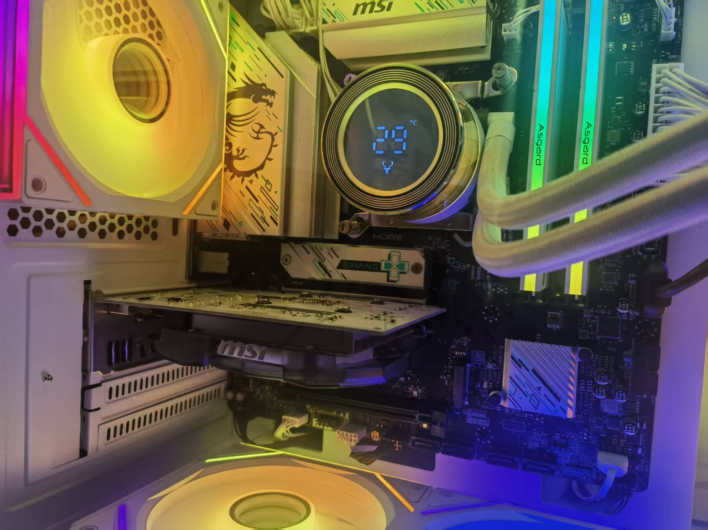
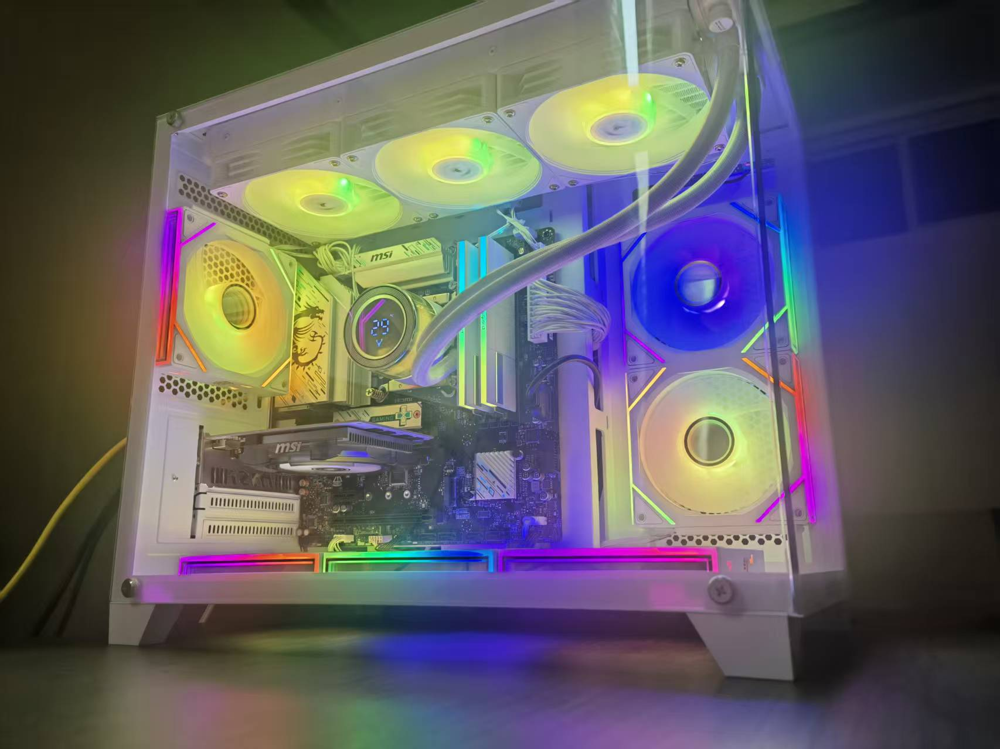
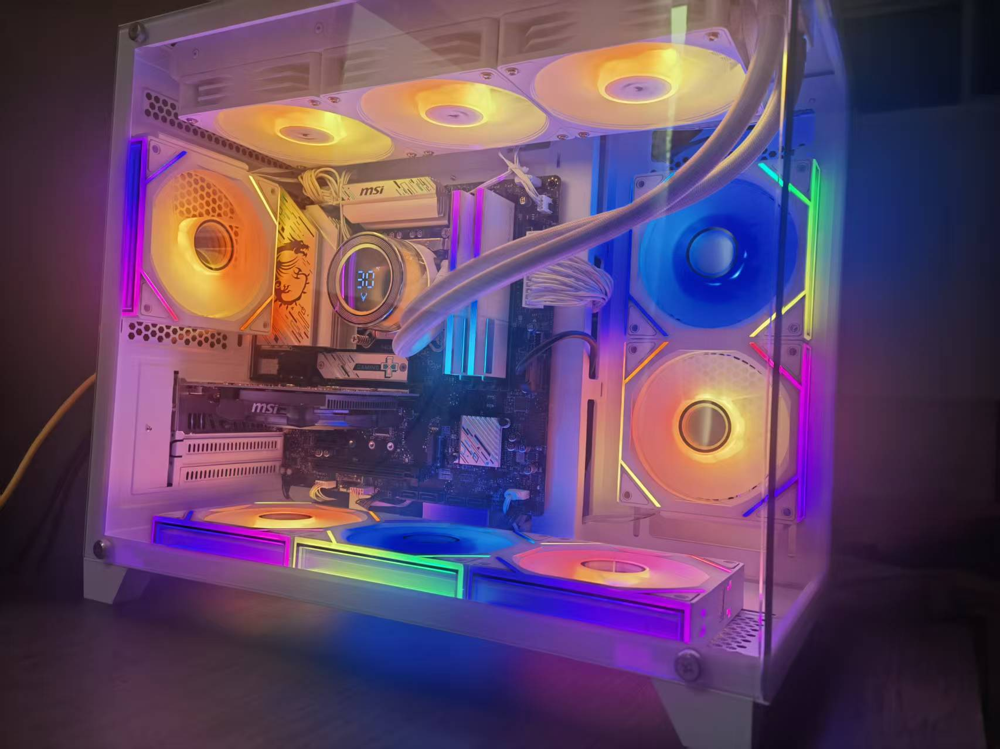
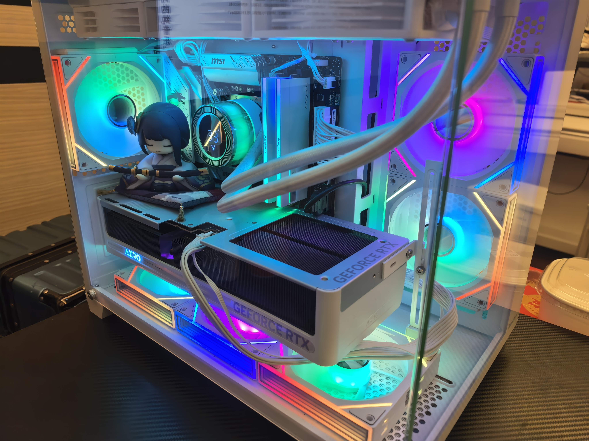

# 锵锵锵！我的第一台台式机！

[toc]

先上图。没学过摄影，凑合着看吧。

- **新显卡**：技嘉 Nvidia Geforce RTX 5070Ti 雪鹰**（￥7500）**

所以，更新一下总花费（刨除之前的￥360的亮机卡）：**￥12192**

除此之外，台式机还有一些外设需要购买，我是缺一个音响，买了个100多的HP有线音响，凑合着用了

# 5070Ti的实际使用体验

我的显示器是2K的，我只测试过**黑神话：悟空**，**赛博朋克：2077**和**鸣潮**三款游戏，拉到最高配置，帧率破百无压力~~😍😍😍
